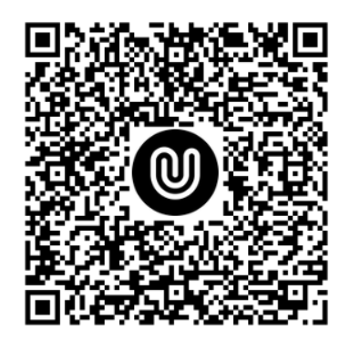

# Digital Verifiable Lab Test Results

> We are building this application mainly for Germany and the EU. We want to be as open and transparent as possible, 
> also to interested parties in the global developer community and to other stakeholders who do not speak German. 
> Consequently, most of the content will be made available in german and english language.

## General Idea

The idea of this system is to make a lab-result available in a digital form in a privacy friendly way and under control of the user.

## Involved Parties/legal entities

At the moment the system described in this repository is operated by UBIRCH GmbH. Some of the services, especially the used public blockchain are operated by other parties, in this case Govdigital e.G.. For some sub-services like the digital lab-certificates for instance services from other players might be used, too. 
The system is meant to be used as a middleware with interfaces and APIs - therefore in real life use-cases it will usually appear embedded into other systems, e.g. patient information systems, entrance management systems etc. - all these other services are under their respective control and would require their own privacy concepts.

## Governance/Open Source

All major parts used in this project are published as OSS Software under Apache Licence 2.0. The UBIRCH protocol can be found [here](https://github.com/ubirch/ubirch-client-go), the UBIRCH Go-client which is used to anchor lab-results can be found [here](https://github.com/ubirch/ubirch-protocol). The UBIRCH verification widget used to verify a lab-result can be found [here](https://github.com/ubirch/ubirch-verify-widget). A demo page based on this can be found [here](https://ubirch.de/v#f=Mustermann;g=Erika;b=19640812;p=T01000322;i=3CF75K8D0L;d=202007011030;t=PCR;r=n;s=2fe00c151cb726bb9ed7).

## Demo QR-Code for Verification

> ⚠ The processing of information is done on the scanner device. Only anonymized data is sent to retrieve the verification data that is then analyzed on the device.

